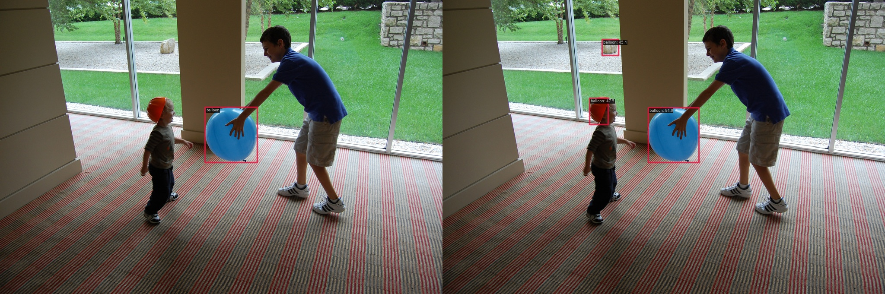
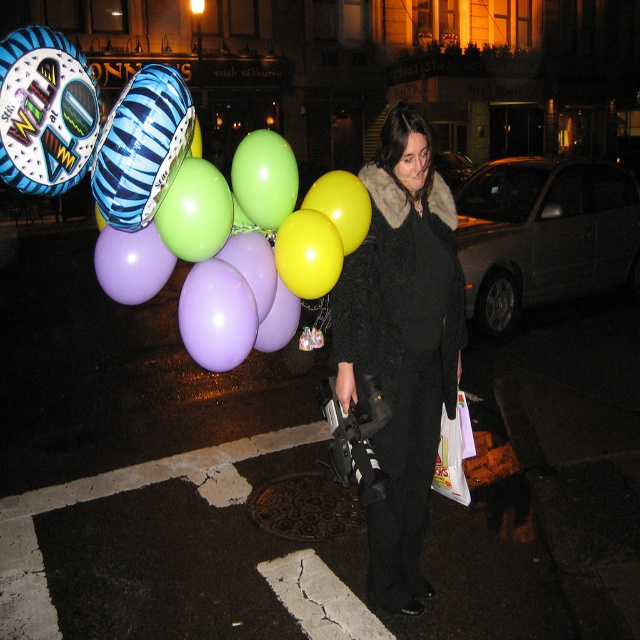
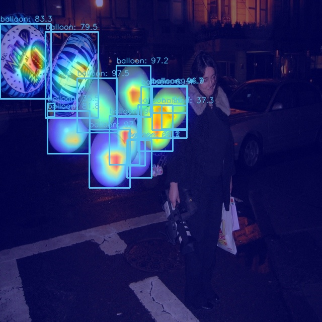

# MMDetection

> **作业：基于 RTMDet 的气球检测**
>
> **背景：熟悉目标检测和 MMDetection 常用自定义流程。**
>
> **任务：**
>
> 基于提供的 notebook，将 cat 数据集换成气球数据集
> 按照视频中 notebook 步骤，可视化数据集和标签
> 使用MMDetection算法库，训练 RTMDet 气球目标检测算法，可以适当调参，提交测试集评估指标
> 用网上下载的任意包括气球的图片进行预测，将预测结果发到群里
> 按照视频中 notebook 步骤，对 demo 图片进行特征图可视化和 Box AM 可视化，将结果发到群里
> 需提交的测试集评估指标（不能低于baseline指标的50%）
> 目标检测 RTMDet-tiny 模型结果的 mAP 不低于 65
> **数据集**
> 气球数据集： https://download.openmmlab.com/mmyolo/data/balloon_dataset.zip

## 模型训练


## 模型测试：

```
 Average Precision  (AP) @[ IoU=0.50:0.95 | area=   all | maxDets=100 ] = 0.746
 Average Precision  (AP) @[ IoU=0.50      | area=   all | maxDets=100 ] = 0.838
 Average Precision  (AP) @[ IoU=0.75      | area=   all | maxDets=100 ] = 0.826
 Average Precision  (AP) @[ IoU=0.50:0.95 | area= small | maxDets=100 ] = 0.000
 Average Precision  (AP) @[ IoU=0.50:0.95 | area=medium | maxDets=100 ] = 0.455
 Average Precision  (AP) @[ IoU=0.50:0.95 | area= large | maxDets=100 ] = 0.863
 Average Recall     (AR) @[ IoU=0.50:0.95 | area=   all | maxDets=  1 ] = 0.230
 Average Recall     (AR) @[ IoU=0.50:0.95 | area=   all | maxDets= 10 ] = 0.782
 Average Recall     (AR) @[ IoU=0.50:0.95 | area=   all | maxDets=100 ] = 0.830
 Average Recall     (AR) @[ IoU=0.50:0.95 | area= small | maxDets=100 ] = 0.000
 Average Recall     (AR) @[ IoU=0.50:0.95 | area=medium | maxDets=100 ] = 0.725
 Average Recall     (AR) @[ IoU=0.50:0.95 | area= large | maxDets=100 ] = 0.911
06/11 11:48:55 - mmengine - INFO - bbox_mAP_copypaste: 0.746 0.838 0.826 0.000 0.455 0.863
06/11 11:48:55 - mmengine - INFO - Epoch(test) [13/13]  coco/bbox_mAP: 0.7460  coco/bbox_mAP_50: 0.8380  coco/bbox_mAP_75: 0.8260  coco/bbox_mAP_s: 0.0000  coco/bbox_mAP_m: 0.4550  coco/bbox_mAP_l: 0.8630  data_time: 0.5041  time: 0.5303
```

**可视化：**





**单张图片推理：**
原图：


结果图：


## 特征图可视化：

原图：



### 可视化 backbone 输出的 3 个通道


上图中绘制的 3 个输出特征图对应大中小输出特征图。由于本次训练的 backbone 实际上没有参与训练，从上图可以看到，balloon是在小特征图进行预测，这符合目标检测分层检测思想。

### 可视化 neck 输出的 3 个通道


由于 neck 是参与训练的，并且 FPN 间的信息融合导致输出特征图更加聚集。

### Grad-Based CAM 可视化

由于目标检测的特殊性，这里实际上可视化的并不是 CAM 而是 Grad Box AM。

**(a) 查看 neck 输出的最小输出特征图的 Grad CAM**


**(b) 查看 neck 输出的中等特征图的 Grad CAM**



**(c) 查看 neck 输出的最大输出特征图的 Grad CAM**


