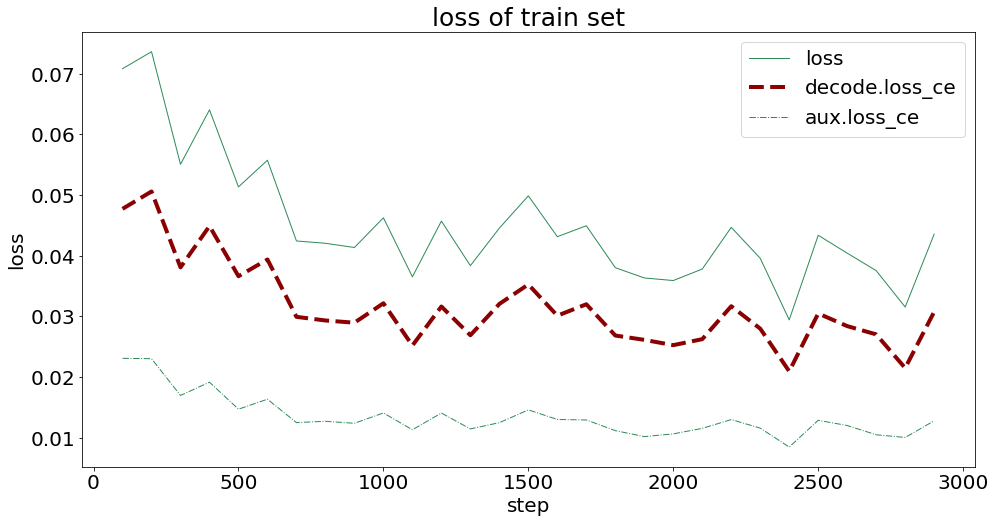
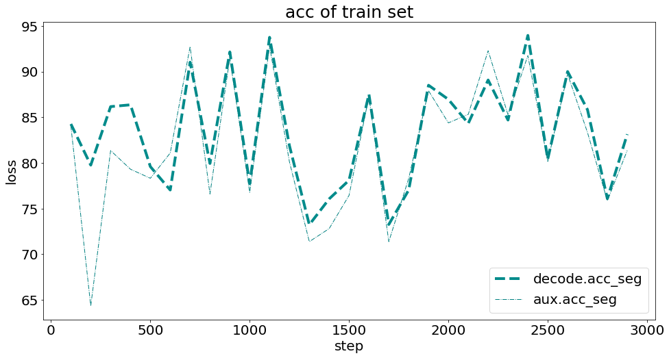
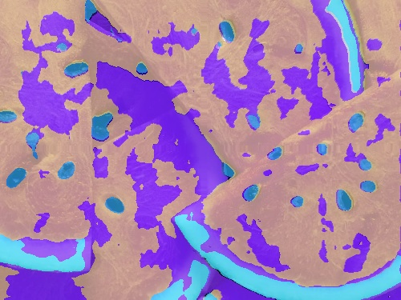

> ## 作业：
>
> - MMSeg 语义分割
>
> ## 背景：
>
> - 西瓜瓤、西瓜皮、西瓜籽像素级语义分割
>
> ## TO DO LIST：
>
> 1. Labelme 标注语义分割数据集（子豪兄已经帮你完成了）；
>
> 2. 划分训练集和测试集（子豪兄已经帮你完成了）；
>
> 3. Labelme 标注转 Mask 灰度图格式（子豪兄已经帮你完成了）；
>
> 4. 使用 MMSegmentation 算法库，撰写 config 配置文件，训练 PSPNet 语义分割算法；
>
> 5. 提交测试集评估指标；
>
> 6. 自己拍摄西瓜图片和视频，将预测结果发到群里；
>
> 7. （选做）训练 Segformer 语义分割算法，提交测试集评估指标。
>
>    

# 训练：

## 配置文件

watermelon_config.py

```
norm_cfg = dict(type='BN', requires_grad=True)
data_preprocessor = dict(
    type='SegDataPreProcessor',
    mean=[123.675, 116.28, 103.53],
    std=[58.395, 57.12, 57.375],
    bgr_to_rgb=True,
    pad_val=0,
    seg_pad_val=255,
    size=(64, 64))
model = dict(
    type='EncoderDecoder',
    data_preprocessor=dict(
        type='SegDataPreProcessor',
        mean=[123.675, 116.28, 103.53],
        std=[58.395, 57.12, 57.375],
        bgr_to_rgb=True,
        pad_val=0,
        seg_pad_val=255,
        size=(256, 256)),
    pretrained='open-mmlab://resnet50_v1c',
    backbone=dict(
        type='ResNetV1c',
        depth=50,
        num_stages=4,
        out_indices=(0, 1, 2, 3),
        dilations=(1, 1, 2, 4),
        strides=(1, 2, 1, 1),
        norm_cfg=dict(type='BN', requires_grad=True),
        norm_eval=False,
        style='pytorch',
        contract_dilation=True),
    decode_head=dict(
        type='PSPHead',
        in_channels=2048,
        in_index=3,
        channels=512,
        pool_scales=(1, 2, 3, 6),
        dropout_ratio=0.1,
        num_classes=6,
        norm_cfg=dict(type='BN', requires_grad=True),
        align_corners=False,
        loss_decode=dict(
            type='CrossEntropyLoss', use_sigmoid=False, loss_weight=1.0)),
    auxiliary_head=dict(
        type='FCNHead',
        in_channels=1024,
        in_index=2,
        channels=256,
        num_convs=1,
        concat_input=False,
        dropout_ratio=0.1,
        num_classes=6,
        norm_cfg=dict(type='BN', requires_grad=True),
        align_corners=False,
        loss_decode=dict(
            type='CrossEntropyLoss', use_sigmoid=False, loss_weight=0.4)),
    train_cfg=dict(),
    test_cfg=dict(mode='whole'))

dataset_type = 'WatermelonDataset'
data_root = 'Watermelon87_Semantic_Seg_Mask/'
crop_size = (256, 256)
train_pipeline = [
    dict(type='LoadImageFromFile'),
    dict(type='LoadAnnotations'),
    dict(
        type='RandomResize',
        scale=(2048, 1024),
        ratio_range=(0.5, 2.0),
        keep_ratio=True),
    dict(type='RandomCrop', crop_size=(64, 64), cat_max_ratio=0.75),
    dict(type='RandomFlip', prob=0.5),
    dict(type='PhotoMetricDistortion'),
    dict(type='PackSegInputs')
]
test_pipeline = [
    dict(type='LoadImageFromFile'),
    dict(type='Resize', scale=(2048, 1024), keep_ratio=True),
    dict(type='LoadAnnotations'),
    dict(type='PackSegInputs')
]
img_ratios = [0.5, 0.75, 1.0, 1.25, 1.5, 1.75]
tta_pipeline = [
    dict(type='LoadImageFromFile', file_client_args=dict(backend='disk')),
    dict(
        type='TestTimeAug',
        transforms=[[{
            'type': 'Resize',
            'scale_factor': 0.5,
            'keep_ratio': True
        }, {
            'type': 'Resize',
            'scale_factor': 0.75,
            'keep_ratio': True
        }, {
            'type': 'Resize',
            'scale_factor': 1.0,
            'keep_ratio': True
        }, {
            'type': 'Resize',
            'scale_factor': 1.25,
            'keep_ratio': True
        }, {
            'type': 'Resize',
            'scale_factor': 1.5,
            'keep_ratio': True
        }, {
            'type': 'Resize',
            'scale_factor': 1.75,
            'keep_ratio': True
        }],
                    [{
                        'type': 'RandomFlip',
                        'prob': 0.0,
                        'direction': 'horizontal'
                    }, {
                        'type': 'RandomFlip',
                        'prob': 1.0,
                        'direction': 'horizontal'
                    }], [{
                        'type': 'LoadAnnotations'
                    }], [{
                        'type': 'PackSegInputs'
                    }]])
]
train_dataloader = dict(
    batch_size=8,
    num_workers=2,
    persistent_workers=True,
    sampler=dict(type='InfiniteSampler', shuffle=True),
    dataset=dict(
        type='WatermelonDataset',
        data_root='Watermelon87_Semantic_Seg_Mask/',
        data_prefix=dict(
            img_path='img_dir/train', seg_map_path='ann_dir/train'),
        pipeline=[
            dict(type='LoadImageFromFile'),
            dict(type='LoadAnnotations'),
            dict(
                type='RandomResize',
                scale=(2048, 1024),
                ratio_range=(0.5, 2.0),
                keep_ratio=True),
            dict(type='RandomCrop', crop_size=(64, 64), cat_max_ratio=0.75),
            dict(type='RandomFlip', prob=0.5),
            dict(type='PhotoMetricDistortion'),
            dict(type='PackSegInputs')
        ]))
val_dataloader = dict(
    batch_size=1,
    num_workers=4,
    persistent_workers=True,
    sampler=dict(type='DefaultSampler', shuffle=False),
    dataset=dict(
        type='WatermelonDataset',
        data_root='Watermelon87_Semantic_Seg_Mask/',
        data_prefix=dict(img_path='img_dir/val', seg_map_path='ann_dir/val'),
        pipeline=[
            dict(type='LoadImageFromFile'),
            dict(type='Resize', scale=(2048, 1024), keep_ratio=True),
            dict(type='LoadAnnotations'),
            dict(type='PackSegInputs')
        ]))
test_dataloader = dict(
    batch_size=1,
    num_workers=4,
    persistent_workers=True,
    sampler=dict(type='DefaultSampler', shuffle=False),
    dataset=dict(
        type='WatermelonDataset',
        data_root='Watermelon87_Semantic_Seg_Mask/',
        data_prefix=dict(img_path='img_dir/val', seg_map_path='ann_dir/val'),
        pipeline=[
            dict(type='LoadImageFromFile'),
            dict(type='Resize', scale=(2048, 1024), keep_ratio=True),
            dict(type='LoadAnnotations'),
            dict(type='PackSegInputs')
        ]))
val_evaluator = dict(type='IoUMetric', iou_metrics=['mIoU'])
test_evaluator = dict(type='IoUMetric', iou_metrics=['mIoU'])
default_scope = 'mmseg'
env_cfg = dict(
    cudnn_benchmark=True,
    mp_cfg=dict(mp_start_method='fork', opencv_num_threads=0),
    dist_cfg=dict(backend='nccl'))
vis_backends = [dict(type='LocalVisBackend')]
visualizer = dict(
    type='SegLocalVisualizer',
    vis_backends=[dict(type='LocalVisBackend')],
    name='visualizer')
log_processor = dict(by_epoch=False)
log_level = 'INFO'
load_from = None
resume = False
tta_model = dict(type='SegTTAModel')
optimizer = dict(type='SGD', lr=0.01, momentum=0.9, weight_decay=0.0005)
optim_wrapper = dict(
    type='OptimWrapper',
    optimizer=dict(type='SGD', lr=0.01, momentum=0.9, weight_decay=0.0005),
    clip_grad=None)
param_scheduler = [
    dict(
        type='PolyLR',
        eta_min=0.0001,
        power=0.9,
        begin=0,
        end=40000,
        by_epoch=False)
]
train_cfg = dict(type='IterBasedTrainLoop', max_iters=3000, val_interval=400)
val_cfg = dict(type='ValLoop')
test_cfg = dict(type='TestLoop')
default_hooks = dict(
    timer=dict(type='IterTimerHook'),
    logger=dict(type='LoggerHook', interval=100, log_metric_by_epoch=False),
    param_scheduler=dict(type='ParamSchedulerHook'),
    checkpoint=dict(type='CheckpointHook', by_epoch=False, interval=1500,save_best='auto'),
    sampler_seed=dict(type='DistSamplerSeedHook'),
    visualization=dict(type='SegVisualizationHook'))
work_dir = './work_dirs/watermelon'
randomness = dict(seed=0)
```

## 载入config配置文件

```
from mmengine import Config
cfg = Config.fromfile('watermelon_config.py')
```

## 准备训练

```
from mmengine.runner import Runner
from mmseg.utils import register_all_modules

# register all modules in mmseg into the registries
# do not init the default scope here because it will be init in the runner
register_all_modules(init_default_scope=False)
runner = Runner.from_cfg(cfg)
```

## 开始训练

```
runner.train()
```

训练过程损失变化：



训练过程准确率变化：



# 测试

```
python tools/test.py watermelon_config.py work_dirs/watermelon/best_aAcc_iter_2800.pth
```

```
2023/06/17 19:57:12 - mmengine - WARNING - The prefix is not set in metric class IoUMetric.
2023/06/17 19:57:13 - mmengine - INFO - Load checkpoint from work_dirs/watermelon/best_aAcc_iter_2800.pth
2023/06/17 19:57:21 - mmengine - INFO - per class results:
2023/06/17 19:57:21 - mmengine - INFO - 
+------------+-------+-------+
|   Class    |  IoU  |  Acc  |
+------------+-------+-------+
|    red     | 82.66 | 98.29 |
|   green    |  75.7 | 78.19 |
|   white    |  43.1 | 45.66 |
| seed-black | 67.25 | 69.49 |
| seed-white | 59.43 | 82.82 |
| Unlabeled  |  3.28 |  3.29 |
+------------+-------+-------+
2023/06/17 19:57:21 - mmengine - INFO - Iter(test) [11/11]  aAcc: 87.1100  mIoU: 55.2400  mAcc: 62.9600  data_time: 0.0019  time: 0.6689
```

# 推理

```
img = mmcv.imread('test.jpg')
result = inference_model(model, img)
visualization = show_result_pyplot(model, img, result, opacity=0.7, out_file='pred.jpg')
```


