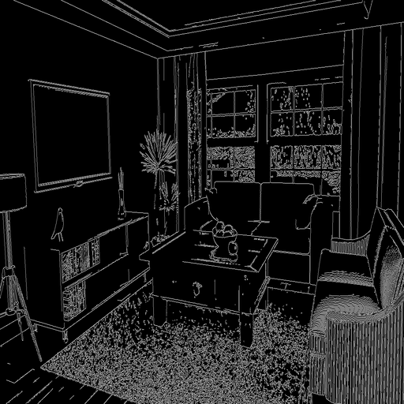

> **作业：ControlNet 的 N 种玩法**
> 假设你是某装修公司的设计师，客户发了你毛坯房的照片，想让你设计未来装修好的效果图。
> 先将毛坯房照片，用 OpenCV 转为 Canny 边缘检测图，然后输入 ControlNet，用 Prompt 咒语控制生成效果。
> 将毛坯房图、Canny 边缘检测图、咒语 Prompt、ControlNet 生成图，做成一页海报，发到群里。作业：ControlNet 的 N 种玩法

# 安装配置MMagic

## 前置环境

```python
Pytorch 版本 1.10.1+cu113
CUDA 是否可用 True
MMCV版本 2.0.0
CUDA版本 11.3
编译器版本 GCC 9.3
```

## 从源码安装MMagic

```python
!git clone https://github.com/open-mmlab/mmagic.git # 下载 mmagic 源代码
import os
os.chdir('mmagic')
!pip3 install -e .
```

```python
# 检查 mmagic
import mmagic
print('MMagic版本', mmagic.__version__)

MMagic版本 1.0.2dev0
```

## 安装其它工具包

```python
!pip install opencv-python pillow matplotlib seaborn tqdm -i https://pypi.tuna.tsinghua.edu.cn/simple
!pip install clip transformers gradio 'httpx[socks]' diffusers==0.14.0 -i https://pypi.tuna.tsinghua.edu.cn/simple
```

# 图生图-ControlNet-Canny

同济子豪兄 2023-6-13

MMagic文档：https://github.com/open-mmlab/mmagic/tree/main/configs/controlnet

ControlNet官方Repo：https://github.com/lllyasviel/ControlNet

## 进入 MMagic 主目录

```python
import os
os.chdir('mmagic')
```

## 导入工具包

```python
import cv2
import numpy as np
import mmcv
from mmengine import Config
from PIL import Image

from mmagic.registry import MODELS
from mmagic.utils import register_all_modules

register_all_modules()
```

## 载入ControlNet模型

```python
cfg = Config.fromfile('configs/controlnet/controlnet-canny.py')
controlnet = MODELS.build(cfg.model).cuda()
```

```python
06/18 20:10:08 - mmengine - INFO - Set model dtype to 'torch.float32'.
06/18 20:10:20 - mmengine - INFO - Creating runwayml/stable-diffusion-v1-5 by 'HuggingFace'
Do not support Xformers. Please install Xformers first. The program will run without Xformers.
06/18 20:10:22 - mmengine - INFO - Set model dtype to 'torch.float32'.
Do not support Xformers. Please install Xformers first. The program will run without Xformers.
```


## 输入Canny边缘图

```python
control_url = 'https://user-images.githubusercontent.com/28132635/230288866-99603172-04cb-47b3-8adb-d1aa532d1d2c.jpg'
control_img = mmcv.imread(control_url)
control = cv2.Canny(control_img, 100, 200)
control = control[:, :, None]
control = np.concatenate([control] * 3, axis=2)
control = Image.fromarray(control)
```

## 咒语Prompt

```python
prompt = 'Room with pink walls and a white ceiling.'
```

## 执行预测

```python
output_dict = controlnet.infer(prompt, control=control)
samples = output_dict['samples']
for idx, sample in enumerate(samples):
    sample.save(f'sample_{idx}.png')
controls = output_dict['controls']
for idx, control in enumerate(controls):
    control.save(f'control_{idx}.png')
```

```python
100%|██████████| 20/20 [00:07<00:00,  2.53it/s]
```


Canny算子：



预测：

